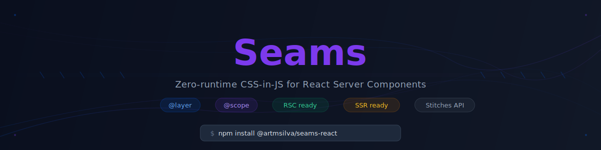

<p align="center">
  
</p>

<p align="center">
  <a href="https://artmsilva.github.io/seams/">Documentation</a> &bull;
  <a href="#installation">Installation</a> &bull;
  <a href="#usage">Usage</a> &bull;
  <a href="https://github.com/artmsilva/seams/tree/main/examples">Examples</a>
</p>

---

Zero-runtime CSS-in-JS for React Server Components, inspired by [Stitches.js](https://stitches.dev).

## Features

- **1:1 API compatibility** with the original Stitches
- **Zero runtime** — CSS is extracted at build time
- **React Server Components support** — works in RSC environments
- **CSS `@layer`** for cascade control
- **CSS `@scope`** for component isolation

## Installation

```bash
pnpm add @artmsilva/seams-react
```

For framework-specific setup, install the appropriate plugin:

```bash
# Next.js
pnpm add @artmsilva/seams-next-plugin

# Vite
pnpm add @artmsilva/seams-vite-plugin
```

## Usage

```tsx
import { styled, css } from "@artmsilva/seams-react";

const Button = styled("button", {
  backgroundColor: "$primary",
  borderRadius: "8px",
  padding: "10px 20px",

  variants: {
    size: {
      small: { fontSize: "14px" },
      large: { fontSize: "18px" },
    },
  },
});

export default function App() {
  return <Button size="large">Click me</Button>;
}
```

## Packages

| Package                        | Description                             |
| ------------------------------ | --------------------------------------- |
| `@artmsilva/seams-core`        | Isomorphic API (no React dependency)    |
| `@artmsilva/seams-react`       | React bindings with `styled()` function |
| `@artmsilva/seams-next-plugin` | Next.js webpack loader                  |
| `@artmsilva/seams-vite-plugin` | Vite transform plugin                   |

## How It Works

Seams extracts CSS at build time instead of generating it at runtime. This enables full React Server Components support.

### Token Transformation

```tsx
// Input
{ color: '$colors$primary' }

// Output CSS
{ color: var(--prefix-colors-primary) }
```

### Dynamic Values

Dynamic values are converted to CSS variables:

```tsx
// Input
<Box css={{ margin: dynamicVal }} />

// Output CSS
.c-Box-inline-xyz { margin: var(--seams-dyn-0); }

// Output JS
<Box className="c-Box-inline-xyz" style={{ '--seams-dyn-0': dynamicVal }} />
```

### CSS Layer Order

Styles are organized into layers for predictable cascade ordering:

```css
@layer seams.themed,    /* Theme CSS variables */
       seams.global,    /* globalCss() styles */
       seams.styled,    /* Base component styles */
       seams.onevar,    /* Single variant styles */
       seams.resonevar, /* Responsive variant styles */
       seams.allvar,    /* Compound variant styles */
       seams.inline; /* css prop styles */
```

## Development

This project uses [Vite+](https://viteplus.dev/) as the unified toolchain.

```bash
# Install dependencies
vp install

# Build all packages
vp run build

# Run tests
vp test

# Format, lint, and type check
vp check

# Type check only
vp run typecheck
```

## Requirements

- Node.js >= 24.0.0
- React 18.3+ or 19+

## License

MIT
